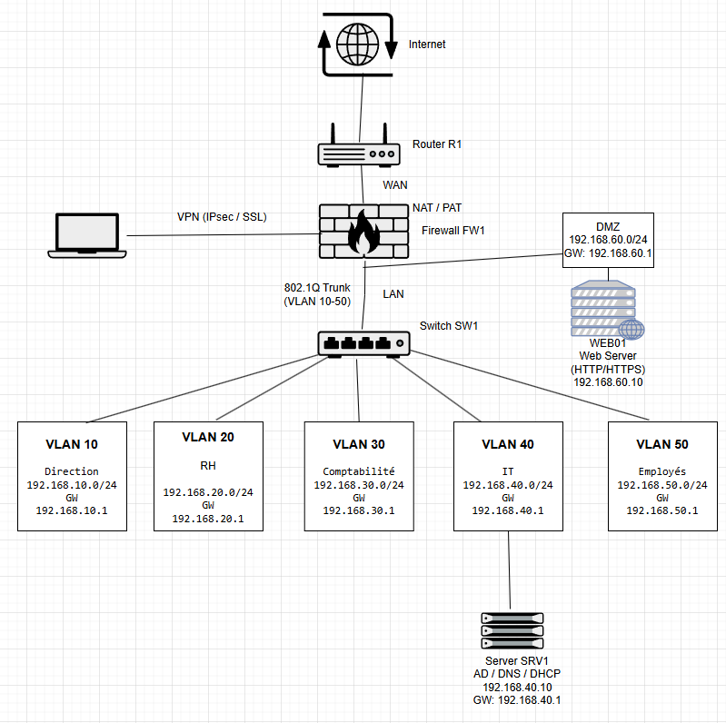

# Architecture réseau sécurisée pour PME

## Présentation

Ce projet simule l'architecture réseau sécurisée d'une PME réalisée avec Cisco Packet Tracer.

L'objectif est de concevoir une infrastructure réseau segmentée et sécurisée similaire à celle utilisée en entreprise.

## Architecture du réseau

L'infrastructure comprend :

* Router R1 : accès WAN / Internet
* Firewall FW1 : routage inter-VLAN, NAT/PAT et règles ACL
* Switch SW1 : segmentation du réseau
* VLAN pour chaque service
* Serveur interne
* DMZ pour le serveur web
* Accès distant simulé

## Segmentation réseau

| VLAN    | Service      | Réseau          |
| ------- | ------------ | --------------- |
| VLAN 10 | Direction    | 192.168.10.0/24 |
| VLAN 20 | RH           | 192.168.20.0/24 |
| VLAN 30 | Comptabilité | 192.168.30.0/24 |
| VLAN 40 | IT           | 192.168.40.0/24 |
| VLAN 50 | Employés     | 192.168.50.0/24 |

DMZ :

192.168.60.0/24

## Sécurité mise en place

* segmentation réseau par VLAN
* routage inter-VLAN
* firewall avec ACL
* isolation du serveur web dans une DMZ
* NAT/PAT pour l'accès Internet
* simulation d'attaque externe

## Technologies utilisées

* Cisco Packet Tracer
* VLAN
* 802.1Q Trunk
* ACL
* NAT / PAT
* DMZ
* Routage inter-VLAN

## Compétences démontrées

* conception d'architecture réseau
* configuration d'équipements Cisco
* segmentation réseau
* sécurité réseau
* mise en place d'une DMZ
