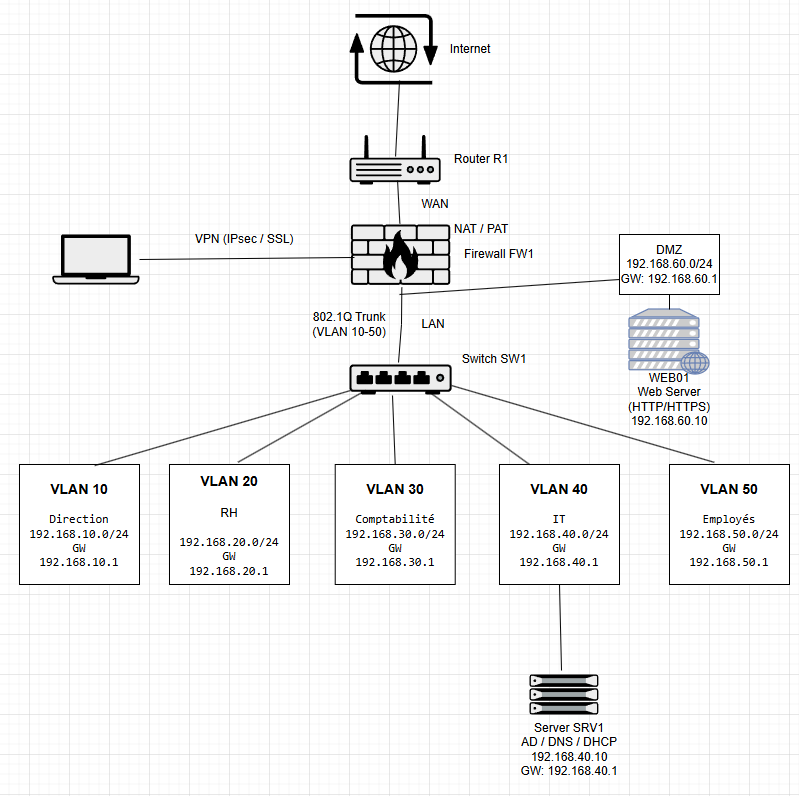
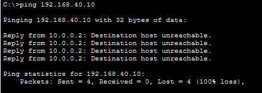

# Architecture réseau sécurisée pour PME

## Présentation

Ce projet simule l'architecture réseau sécurisée d'une PME réalisée avec Cisco Packet Tracer.

L'objectif est de concevoir une infrastructure réseau segmentée et sécurisée similaire à celle utilisée en entreprise.

## Architecture du réseau

L'infrastructure comprend :

* Router R1 : accès WAN / Internet
* Firewall FW1 : routage inter-VLAN, NAT/PAT et règles ACL
* Switch SW1 : segmentation du réseau
* VLAN pour chaque service
* Serveur interne
* DMZ pour le serveur web
* Accès distant simulé

## Segmentation réseau

| VLAN    | Service      | Réseau          |
| ------- | ------------ | --------------- |
| VLAN 10 | Direction    | 192.168.10.0/24 |
| VLAN 20 | RH           | 192.168.20.0/24 |
| VLAN 30 | Comptabilité | 192.168.30.0/24 |
| VLAN 40 | IT           | 192.168.40.0/24 |
| VLAN 50 | Employés     | 192.168.50.0/24 |

DMZ :

192.168.60.0/24

## Sécurité mise en place

* segmentation réseau par VLAN
* routage inter-VLAN
* firewall avec ACL
* isolation du serveur web dans une DMZ
* NAT/PAT pour l'accès Internet
* simulation d'attaque externe

## Technologies utilisées

* Cisco Packet Tracer
* VLAN
* 802.1Q Trunk
* ACL
* NAT / PAT
* DMZ
* Routage inter-VLAN

## Compétences démontrées

* conception d'architecture réseau
* configuration d'équipements Cisco
* segmentation réseau
* sécurité réseau
* mise en place d'une DMZ

## Tests et validation

### Test 1 — Protection du serveur interne (SRV1)
Un test de ping depuis un poste externe (Remote-User, simulant Internet) vers le serveur interne SRV1 (192.168.40.10) a été réalisé pour valider l'étanchéité du périmètre réseau.

**Résultat initial** : le test a révélé une faille — l'ACL 110 appliquée sur l'interface WAN du firewall FW1 se terminait par une règle `permit ip any any`, autorisant tout trafic entrant depuis Internet vers le réseau interne, y compris vers SRV1.

**Correction apportée** : l'ACL 110 a été restreinte pour n'autoriser que le trafic HTTP (80) et HTTPS (443) à destination du serveur web WEB01 en DMZ, avec un `deny ip any any` implicite pour tout le reste.

**Résultat après correction** :

Le firewall FW1 rejette désormais explicitement toute tentative d'accès externe vers SRV1, confirmant l'étanchéité du réseau interne.

### Conclusion
Ce test met en évidence l'importance de vérifier systématiquement les règles ACL par défaut (deny/permit implicite) plutôt que de se fier uniquement à la configuration de segmentation par VLAN. La correction a permis de fermer une exposition non intentionnelle du réseau interne depuis Internet.
